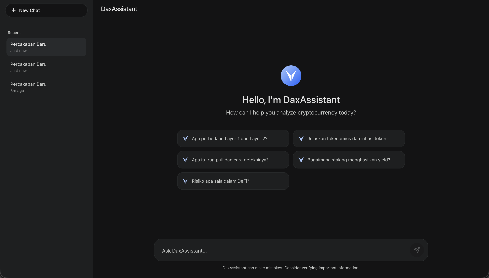

# DaxAssistant - Cryptocurrency Analyst Chatbot

DaxAssistant is an AI-powered chatbot designed to act as an educational Cryptocurrency Analyst. It leverages the **Gemini 2.5 Flash** model to provide logical, data-driven, and risk-aware explanations about blockchain, DeFi, and cryptocurrency concepts.



## Features ✨

- **Educational Crypto Analysis**: Explains complex topics like Layer 1 vs Layer 2, Tokenomics, Staking, and Smart Contract risks.
- **True API Streaming**: Real-time smooth streaming of responses directly from the Gemini API.
- **Clean UI**: A sleek, modern, and readable interface inspired by Google Gemini.
- **Conversation History**: Automatically saves your past conversations locally so you never lose your analysis history.
- **Live Data Grounding**: Equipped with function calling to fetch real-time crypto prices via CoinGecko.

## Tech Stack 🛠

- **Frontend**: React 19, TypeScript, Vite
- **Styling**: Tailwind CSS
- **Markdown Parsing**: `react-markdown` + `remark-gfm`
- **AI Integration**: `@google/genai` (Gemini SDK)
- **Icons**: `lucide-react`

## Getting Started 🚀

### 1. Clone the Repository

```bash
git clone https://github.com/justlyznn/ChatBot_DaxAssistant.git
cd ChatBot_DaxAssistant
```

### 2. Install Dependencies

```bash
npm install
```

### 3. Environment Variables

Create a `.env` file in the root directory and add your Google Gemini API key:

```env
VITE_GEMINI_API_KEY=your_gemini_api_key_here
```

### 4. Run the Development Server

```bash
npm run dev
```

The app will be available at `http://localhost:5173`.

## Disclaimer ⚠️

DaxAssistant is designed for **educational purposes only**. It is explicitly instructed not to provide financial advice, price predictions, or buy/sell recommendations. Always do your own research (DYOR) before making any investment decisions in the cryptocurrency market.
